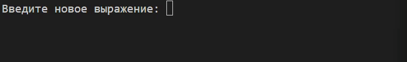
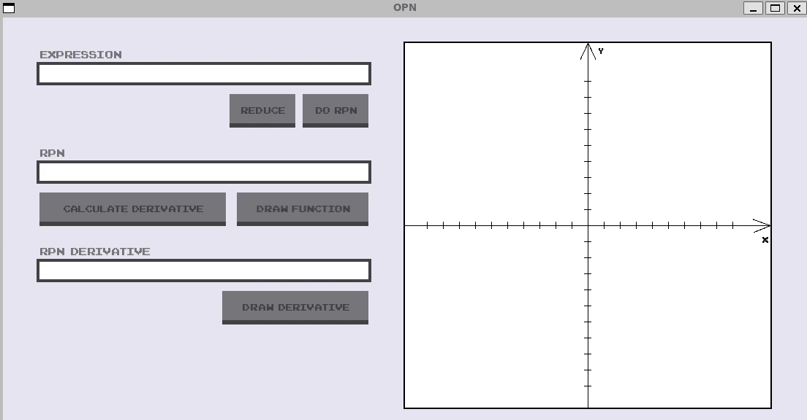

# Стековый калькулятор (ОПН)


> Консольный и графический калькулятор с поддержкой обратной польской нотации (ОПН).  
> Возможности: построение графика функции, вычисление производной, касательной.

##### Пример работы консольного приложения


##### Пример работы графического приложения


---

## 📝 Что можно вводить

### Базовые операции
| Символ | Описание | Пример |
|--------|----------|--------|
| `+` | Сложение | `2+3` |
| `-` | Вычитание / унарный минус | `5-2` или `-5` |
| `*` | Умножение | `4*5` |
| `/` | Деление | `10/2` |
| `^` | Возведение в степень | `2^3` → 8 |

### Функции
| Символ | Описание | Пример |
|--------|----------|--------|
| `sin` | Синус (в радианах) | `sin(3.14)` |
| `cos` | Косинус (в радианах) | `cos(0)` |
| `ln` | Натуральный логарифм | `ln(10)` |

### Константы и переменные
| Символ | Описание | Пример |
|--------|----------|--------|
| `x` | Переменная (для графиков) | `x^2 + 2*x` |
| `pi` | Число π (3.1415) | `sin(pi/2)` → 1 |
| `e` | Число e (2.7182) | `ln(e)` → 1 |

### Скобки и пробелы
| Символ | Описание |
|--------|----------|
| `(` `)` | Группировка выражений |
| ` ` (пробел) | Игнорируется, можно использовать для читаемости |

---

### ✅ Корректные примеры выражений

3+4*2/(1-5)^2

sin(pi/2) + cos(0) - ln(e)

x^3 - 2*x^2 + 5

-5 + (2+3)*4

2^3^2 (правоассоциативно: 2^(3^2) = 512)

sin(cos(x)) (вложенные функции)

### ❌ Некорректные примеры (выдадут ошибку)
3++5 (два оператора подряд)

sinx (нужны скобки: sin(x))

2/0 (деление на ноль)

(3+4 (незакрытая скобка)

3.14.15 (несколько точек в числе)

ln -5 (логарифм от отрицательного числа)

text

---

## Что входит в проект

| Версия | Описание |
|--------|----------|
| **Консольная** (`Lab1`) | Базовый калькулятор: ввод выражения → ОПН → результат. Работает без дополнительных библиотек. |
| **Графическая** (`Lab2`) | Полноценное GUI с построением графиков, производных и касательных. Требует SFML. |

---

## Как запустить (Windows)

### Консольная версия

Консольная версия **не требует установки SFML**. Достаточно компилятора C++.

```bash
# Через WSL (Ubuntu)
cd Lab1
g++ main.cpp -o calculator -std=c++17
./calculator
```

```cmd
# Через командную строку Windows с MinGW
cd Lab1
g++ main.cpp -o calculator.exe -std=c++17
calculator.exe
```

### Графическая версия

Шаг 1. Установка SFML в WSL
```bash
sudo apt update
sudo apt install libsfml-dev
```

Шаг 2. Компиляция графической версии
```bash
cd Lab2
g++ main.cpp -o gui_app -std=c++17 -lsfml-graphics -lsfml-window -lsfml-system
./gui_app
```
### Графическая версия на чистом Windows (без WSL)

[Скачайте SFML для Windows](https://www.sfml-dev.org/download.php) (выберите `GCC 13.1.0 MinGW` под вашу версию)

Распакуйте архив, например в `C:\SFML`

Компиляция:
```cmd
g++ main.cpp -o gui.exe -std=c++17 -IC:\SFML\include -LC:\SFML\lib -lsfml-graphics -lsfml-window -lsfml-system
```
Скопируйте DLL-файлы из `C:\SFML\bin` в папку с `gui.exe`

## Как пользоваться
### Консольная версия
```text
Введите выражение: 3+4*2/(1-5)^2
Выражение: 3+4*2/(1-5)^2
RPN: 3 4 2 * 1 5 - 2 ^ / + 
Ответ: 3.5
```

### Графическая версия
1. Введите выражение в поле (можно использовать x, pi, e). Для этого нужно нажать `enter` на клавиатуре. После написания выражения нажмите `esc` на клавиатуре
2. Нажмите "Do RPN" — программа покажет обратную польскую запись
3. Нажмите "Draw Function" — построится график
4. Нажмите "Calculate Derivative" - программа покажет обратную польскую запись производной
5. Нажмите "Draw Derivative" — на графике появится производная
6. Кликните по графику, чтобы нарисовать касательную (точка + прямая)
7. Чтобы очистить график функции, снова нажмите Do RPN.

## Обработка ошибок
| Сообщение | Причина |
|-----------|---------|
| Empty expression! | Пустая строка |
| Zero division! | Деление на ноль |
| No operands entered | Не хватает чисел (например, +3) |
| Wrong operator or operand format | Некорректный ввод: лишние точки, неправильные функции, незакрытые скобки |

## FAQ
```
Q: Можно ли использовать пробелы?
A: Да, пробелы игнорируются. 2 + 2 работает как 2+2.

Q: Как ввести унарный минус?
A: Напишите минус перед числом или скобкой: -5 или -(2+3).

Q: В каком порядке вычисляется ^?
A: Степень правоассоциативна: 2^3^2 = 2^(3^2) = 512.

Q: У меня ошибка fatal error: SFML/Graphics.hpp: No such file
A: SFML не установлен. Используйте консольную версию или установите SFML по инструкции.

Q: График не рисуется / белое окно
A: Проверьте, что шрифт загружается

Q: Касательные не сохраняются
A: Они сохраняются в вектор tangents и рисуются при каждом клике. При повторном нажатии Do RPN список очищается — это нормально.
```